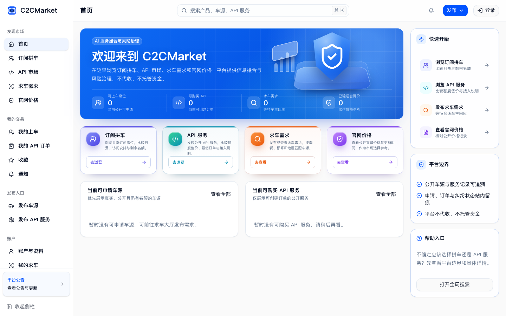

<p align="center">
  
</p>

<h1 align="center">C2CMarket</h1>

<p align="center">
  面向 linux.do 用户的社区撮合市场，聚合订阅拼车、API 服务与官网公开价记录。
</p>

<p align="center">
  <a href="https://c2cmarket.shop"><strong>在线访问</strong></a> ·
  <a href="./docs/openapi/c2c-market-api-v1.yaml">API 契约</a> ·
  <a href="./docs/ops/deployment-runbook.md">部署文档</a> ·
  <a href="./CONTRIBUTING.md">参与贡献</a>
</p>

<p align="center">
  <a href="./README.md">简体中文</a> · <a href="./README_EN.md">English</a>
</p>

<p align="center">
  <a href="https://github.com/xiangrikuil/c2cmarket/actions/workflows/ci.yml"></a>
  <a href="./LICENSE"></a>
  <a href="https://linux.do"></a>
  
  
</p>

<p align="center">
  <a href="https://c2cmarket.shop">
    
  </a>
</p>

> [!NOTE]
> 项目仍在开发中。API、数据库 migration 与部署配置在 1.0 前可能调整；生产部署请先核对[发布检查清单](./docs/release-checklist.md)。

## 为什么做 C2CMarket

linux.do 社区里一直有订阅拼车和 API 服务额度的供需，但信息散落在帖子和不同服务中。买卖双方没有一个集中查看资料、订单、评价和纠纷记录的地方，交易前难以判断对方是否可靠，出了问题也很难追溯。

ChatGPT、Claude 等服务也常出现一边用不完、一边不够用的情况。中转站和公益服务解决了一部分需求，但来源、规则和持续性各不相同。C2CMarket 把这些供需放进同一个市场，让双方先看公开资料和历史记录，再决定是否在线下交易。

## 关于 C2CMarket

C2CMarket 把订阅拼车、API 服务、求车需求和官网公开价记录放在同一个市场中。用户可以浏览或发布信息。平台记录申请、订单、评价和纠纷状态；沟通和付款在线下完成。

平台不处理站内支付，不提供托管或履约担保，也不代理上游 API 流量。这个边界贯穿公开页面、订单流程和管理后台。

## 功能

- 浏览订阅拼车、API 服务、求车需求和官网价格记录。
- 发布并管理车源或 API 服务，跟踪申请、订单和履约状态。
- 通过公开资料、评价、举报和纠纷记录了解交易对象。
- 使用通知中心、统一搜索和管理后台处理日常业务。

## 技术栈

| 层级 | 技术 |
| --- | --- |
| 前端 | Nuxt 4、Vue 3、TypeScript、Pinia、TanStack Query、Tailwind CSS |
| 后端 | Go 1.26.5、chi、pgx |
| 数据库 | PostgreSQL 18、版本化 SQL migrations |
| 部署 | Docker Compose、Cloudflare Workers、VPS/Caddy、GHCR |
| 集成 | linux.do OAuth 2.0、阿里云 DirectMail SMTP、可选 Umami |

## 快速开始

### 环境要求

- Docker 和 Docker Compose
- Node.js `>=24.11 <25`
- pnpm `>=10 <11`
- Go 1.26.5（仅在 Docker 外运行后端时需要）

### 1. 获取代码与配置

```bash
git clone https://github.com/xiangrikuil/c2cmarket.git
cd c2cmarket
cp .env.example .env
```

### 2. 启动 PostgreSQL 并执行迁移

```bash
docker compose up -d postgres
docker compose --profile migrate run --rm migrate
```

### 3. 启动后端

```bash
docker compose --profile app up -d --build backend
```

后端默认监听 `http://127.0.0.1:8080`。可用的探活端点：

```text
GET /health
GET /readyz
GET /version
```

### 4. 启动前端

```bash
pnpm --dir frontend install --frozen-lockfile
pnpm --dir frontend dev
```

打开 `http://127.0.0.1:5173`。开发命令通过 Nuxt 同源代理连接本地后端；如需纯前端演示，运行 `pnpm --dir frontend dev:mock`。

### 开发账号与快速切换

本地后端启用开发认证后，可以一次准备三个固定账号：

```bash
node scripts/dev-personas.mjs
```

| 身份 | 用户名 | 预置状态 |
| --- | --- | --- |
| 买家 | `dev-buyer` | 已绑定 linux.do、已验证邮箱、备份密码、linux.do 与微信联系方式 |
| 卖家 | `dev-seller` | 买家状态加可用商户资料和微信收款方式 |
| 管理员 | `dev-admin` | 已绑定 linux.do、已验证邮箱、备份密码、真实管理员权限 |

三个账号的本地备份密码都是 `DevPersona#2026`。也可以只准备一个身份，或指定其他本地后端：

```bash
node scripts/dev-personas.mjs seller
node scripts/dev-personas.mjs admin --base-url http://127.0.0.1:18090
```

脚本把 Cookie、CSRF token 和会话响应写入被 Git 忽略的 `output/dev-sessions/*.json`：目录权限为 `0700`，文件权限为 `0600`，终端不会输出原始凭据。真实 API 模式的开发页面顶部也会显示账号切换按钮，切换后使用后端签发的正常会话并刷新用户数据。

这些入口只用于本地开发：后端关闭开发认证时不会注册 `/api/v1/auth/dev-persona-session`，生产构建也不会显示账号切换器。不要把开发会话文件复制到共享目录或提交到仓库。

停止本地服务：

```bash
docker compose --profile app down
```

## 本地验证

提交 Pull Request 前，至少运行与改动范围相关的检查：

```bash
cd backend && go test ./...
cd ..
pnpm --dir frontend typecheck
pnpm --dir frontend test
node scripts/check-openapi-routes.mjs
node scripts/check-openapi-types.mjs
node scripts/check-migrations-doc.mjs
node scripts/check-compose-exposure.mjs
```

生产模式前端构建还需要明确配置站点和 API 地址：

```bash
NUXT_PUBLIC_API_MODE=real \
NUXT_PUBLIC_SITE_URL=https://c2cmarket.shop \
NUXT_PUBLIC_API_BASE_URL=https://api.c2cmarket.shop \
NUXT_API_BASE_URL=https://api.c2cmarket.shop \
pnpm --dir frontend build
```

完整业务 smoke 需要先启动后端：

```bash
API_BASE_URL=http://127.0.0.1:8080 node scripts/run-smokes.mjs
```

## 项目结构

```text
.
├── frontend/          Nuxt 应用
├── backend/           Go HTTP API 与数据库 migrations
├── docs/openapi/      OpenAPI 契约
├── docs/ops/          部署与运维文档
├── scripts/           契约检查、发布与 smoke 脚本
├── compose.yaml       本地开发服务
└── compose.prod.yaml  生产 Compose 覆盖配置
```

## 文档

| 文档 | 内容 |
| --- | --- |
| [OpenAPI 契约](./docs/openapi/c2c-market-api-v1.yaml) | HTTP API、请求与响应结构 |
| [系统结构](./docs/project-architecture-api-db-overview-2026-06-23.md) | 前后端、API 与数据库关系 |
| [部署手册](./docs/ops/deployment-runbook.md) | 环境配置、迁移与发布流程 |
| [Workers/VPS 部署](./docs/ops/cloudflare-workers-vps-backends.md) | Cloudflare 与后端拓扑 |
| [生产运维](./docs/operations.md) | 日常检查与故障处理 |
| [备份恢复](./docs/backup-restore.md) | PostgreSQL 备份与恢复 |
| [发布检查](./docs/release-checklist.md) | 上线前后的核对项 |

## 产品边界

C2CMarket 不是支付、托管、账号托管、履约担保或 API 代理平台。平台不接收第三方账号密码、Cookie、Session、验证码、恢复码或面板主账号凭据。API 订单只允许保存买家专属的一次性交付凭证，并且只能在卖家确认站外收款后向订单参与方展示。

第三方订阅的费用分摊、成员邀请和使用方式可能受到服务提供商条款限制。C2CMarket 与 linux.do、OpenAI 及其他第三方服务提供商不存在官方隶属、授权或担保关系，使用者需要自行核对相关条款。

## 参与贡献

Issue 和 Pull Request 均可提交。开始前请阅读[贡献指南](./CONTRIBUTING.md)，并让每个变更保持范围清楚、可独立验证。

## 许可证

本项目基于 [MIT License](./LICENSE) 开源。
