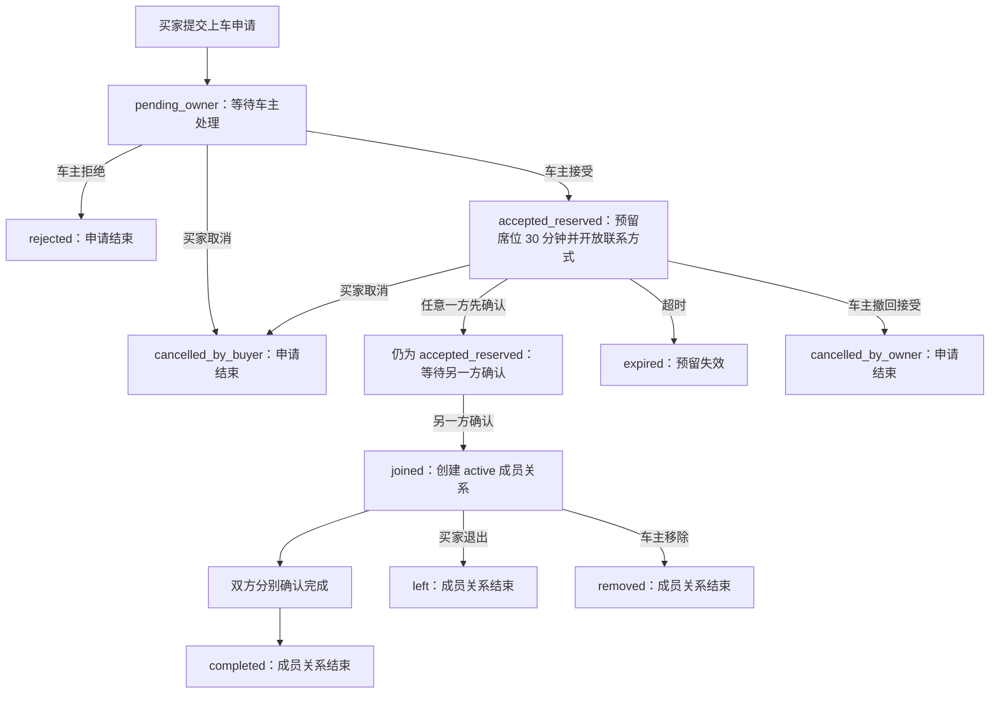
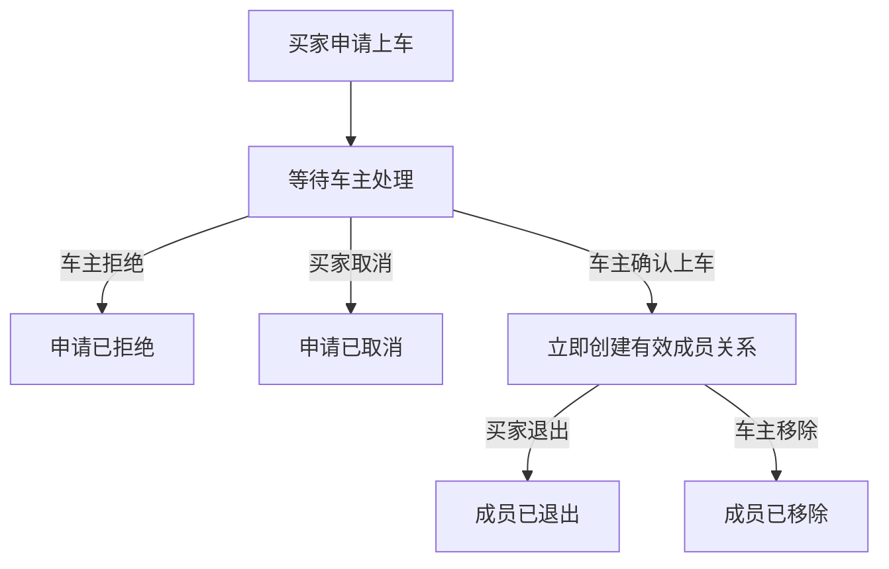

# 拼车车源现状与简化流程讨论稿

> 日期：2026-08-17
> 整理者：Codex
> 用途：提交给 GPT Pro 讨论车源发布、申请上车、成员管理和车源生命周期
> 说明：本文基于当前仓库代码整理。“当前实现”是代码事实；“建议方案”尚未实施。

## 一、结论先行

当前拼车功能的问题不是缺少状态，而是状态和确认动作过多，并且管理入口被拆散了：

1. 买家申请后，车主先“接受并预留席位”，买家和车主还要分别确认上车；只有双方都确认，系统才真正建立成员关系。
2. 上车后，双方还要分别确认完成，成员关系才会结束。
3. “我的车源”中的“组队进行中”和“服务中”不是车源生命周期，而只是用有效成员数是否为 0 来分组。
4. 已发布车源不能由车主编辑、暂停或关闭；移除成员虽然已经有接口，但入口藏在申请详情深处。
5. 当前平台不托管付款，也不负责验证双方线下履约，因此这套双边确认流程带来的操作成本，大于它能提供的业务价值。

建议把主流程收敛为：

```text
买家提交上车申请
  -> 车主拒绝：申请结束
  -> 车主确认上车：立即建立有效成员关系
```

车主的“确认上车”就是最终确认，不再增加席位预留、买家确认上车、车主再次确认上车等步骤。双方如何付款、何时开通和怎样核对服务，由双方在线下自行确认，平台只记录申请结果、成员关系和必要的操作留痕。

## 二、当前车源发布逻辑

### 2.1 发布前条件

车主必须先登录并完成 linux.do 绑定。发布表单当前要求填写或确认：

- 产品套餐和地区；
- 月费；
- 每日、每周额度及额度重置方式；
- VPS 区域及是否支持国内直连；
- 买家总名额和当前已占用名额；
- 开通渠道和付款方式；
- 分发方式、是否提供管理员账号；
- 账号或服务安排说明；
- 车主承诺、补偿说明和买家须知；
- 高风险套餐对应的版本化发布边界确认。

平台只记录车源信息和双方状态，不托管付款，不保存密码、API Key、Session、Cookie 或其他登录凭据。

### 2.2 草稿与直接发布

当前前端有两个动作：

| 操作 | 实际结果 |
| --- | --- |
| 保存草稿 | 创建 `draft` 车源，可继续编辑 |
| 检查并发布 | 调用直接发布接口，新车源立即成为 `active` |

现在的页面和部分函数仍使用“提交审核”“审核中”之类的旧命名，但新建车源实际调用 `/api/v1/carpools/publish`，后端直接创建 `active` 车源，不经过管理员审核。

从草稿编辑页执行“保存并提交”时，代码仍调用名称为 `submit-review` 的接口；当前服务实现同样会直接把符合条件的草稿变为 `active`。因此这里存在明显的文案和接口命名遗留，但实际业务已经是直接发布。

### 2.3 当前车源状态

后端仍保留这些状态：

| 状态 | 含义 |
| --- | --- |
| `draft` | 草稿 |
| `pending_review` | 待审核，主要是遗留流程 |
| `changes_requested` | 被要求修改 |
| `active` | 已发布、可被搜索和申请 |
| `paused` | 已暂停，目前主要由管理员操作 |
| `rejected` | 已拒绝 |
| `removed` | 已下架 |

车主当前没有自己的“暂停招募、恢复招募、关闭车源”接口。暂停和恢复只存在于管理员路由。

## 三、当前买家申请和双方上车逻辑

### 3.1 当前完整流程



### 3.2 买家申请时发生什么

买家确认车源规则并提交申请后：

- 申请状态变为 `pending_owner`；
- 申请保存车源标题、价格、产品政策等快照；
- 同一买家不能对同一车源重复创建进行中的申请；
- 没有剩余名额时不能申请；
- 买家可以在车主处理前取消申请。

这里保存快照是合理的。后续即使车主修改车源，新申请可以使用新规则，已经申请或已经上车的用户仍能看到当时接受的价格和规则。

### 3.3 车主接受后发生什么

车主点击“接受申请并预留席位”后：

- 申请从 `pending_owner` 变为 `accepted_reserved`；
- 该席位被预留 30 分钟；
- 双方联系方式窗口开放 30 分钟；
- 买家和车主都获得“确认上车”按钮；
- 任意一方先确认，只记录这一方的确认时间，不会建立成员关系；
- 另一方也确认后，申请才变成 `joined`，系统创建 `active` 成员关系，并增加车源的有效成员数。

所以，当前“车主接受申请”不等于上车，“车主确认用户已上车”也不一定等于上车。只有双方都点过确认，系统才认为用户已经上车。这正是当前流程最容易让人困惑的地方。

### 3.4 上车后的完成、退出和移除

上车后还有一套成员生命周期：

| 操作 | 当前结果 |
| --- | --- |
| 买家和车主都确认完成 | 成员变为 `completed` |
| 买家退出拼车 | 成员变为 `left` |
| 车主移除成员 | 成员变为 `removed` |

成员结束后，车源的有效成员数会减少。当前评价资格主要依赖 `completed`，因此如果取消“双边确认完成”，必须同时重新设计什么时候可以评价，不能只删除按钮而不处理评价依赖。

## 四、“我的车源”当前显示逻辑

“我的车源”现在有四个页签：

| 页面页签 | 后端筛选条件 | 实际含义 |
| --- | --- | --- |
| 组队进行中 | `status = active` 且 `active_buyer_members = 0` | 已发布，但当前没有有效成员 |
| 服务中 | `status = active` 且 `active_buyer_members > 0` | 已发布，并且至少有一名有效成员 |
| 历史车队 | `status in (rejected, removed)` | 被拒绝或已下架 |
| 草稿与待修改 | `draft / changes_requested / pending_review / paused` | 草稿、待修改、遗留审核中或暂停状态 |

### 4.1 “组队进行中”和“服务中”的真正区别

两者的车源状态其实都是 `active`，唯一差别是有效成员数量：

```text
active_buyer_members = 0  -> 组队进行中
active_buyer_members > 0  -> 服务中
```

它们不是两个稳定的业务阶段，也不反映是否有待处理申请：

- 有 5 个申请等待处理，但还没有有效成员，仍显示“组队进行中”；
- 只有 1 个成员确认上车，就显示“服务中”；
- 最后一个成员完成、退出或被移除后，有效成员数归零，车源又回到“组队进行中”；
- 预留席位和待处理申请不会让车源进入“服务中”；
- 车主没有主动关闭车源时，已经不打算继续招募的车源也可能重新出现在“组队进行中”。

因此，“组队进行中”和“服务中”实际上是列表过滤器，却被展示成了车源生命周期，用户很容易误解。

## 五、为什么已发布车源无法编辑或方便地踢人

### 5.1 发布后不能编辑是代码明确限制

前端只给以下状态显示“编辑”按钮：

```text
draft
changes_requested
```

后端更新接口也只接受这两个状态。已发布的 `active` 车源调用更新接口会返回“当前车源状态不能修改”。所以这不是页面偶发问题，而是当前产品规则本身禁止发布后编辑。

### 5.2 车主缺少车源级管理入口

“我的车源”每行目前主要只有：

- 处理申请；
- 草稿或待修改状态下的编辑。

“处理申请”会进入全局申请队列，不是当前车源的管理页。列表中没有：

- 查看本车源的待处理申请；
- 管理本车源成员；
- 编辑已发布车源；
- 暂停或恢复招募；
- 关闭车源。

### 5.3 “移除成员”已经存在，但入口太深

当前移除路径是：

```text
我的车源
  -> 处理申请
  -> 全部上车申请
  -> 找到对应申请
  -> 进入申请详情
  -> 移除成员
```

后端已经有车主移除有效成员的接口，功能并非完全不存在。但它以“历史申请详情”为中心，而不是以“管理我的车队”为中心，所以车主很难发现，也无法从某一条车源直接看到成员名单后执行操作。

## 六、建议的简化流程

### 6.1 核心原则

平台只做三件事：

1. 记录买家申请；
2. 记录车主是否同意该买家上车；
3. 维护当前成员关系及退出、移除记录。

平台不确认付款是否发生，不判断线下服务是否已经交付，也不要求双方重复点击来证明他们在线下已经达成一致。

### 6.2 推荐上车状态机



建议删除主流程中的这些步骤：

- “接受申请并预留席位”；
- 30 分钟席位预留；
- 买家再次确认上车；
- 车主接受后再次确认上车；
- 双方确认完成。

车主只保留两个处理动作：

```text
确认上车
拒绝申请
```

车主点击“确认上车”后，应在同一事务中完成：

- 申请状态直接变为 `joined`；
- 创建 `active` 成员关系；
- 有效成员数加一；
- 双方获得按规则展示的联系方式；
- 记录事件并通知买家。

如果车主误点或双方线下没有谈成，车主可以移除成员，买家也可以主动退出。买家还应有“实际未上车 / 状态不一致”的报告入口，但这不应阻止正常申请快速完成。

### 6.3 推荐的“我的车源”结构

不建议继续用成员数把车源拆成“组队进行中”和“服务中”。建议改为：

```text
我的车源
  正在招募
  已暂停
  已关闭
  草稿
```

每条车源直接显示：

```text
有效成员 2 / 5
待处理申请 3
剩余名额 3

[管理车队] [编辑车源] [暂停招募] [关闭车源]
```

“管理车队”进入当前车源的独立管理页，而不是全局申请队列。页面内部可分为：

```text
待处理申请 | 当前成员 | 已结束成员 | 车源设置
```

### 6.4 发布后的编辑规则

建议允许车主编辑 `active` 车源，但必须区分新旧成员规则：

- 修改后的内容只对后续新申请生效；
- 已申请和已上车成员继续保留申请时的价格、规则和产品政策快照；
- 总名额不能小于当前有效成员数；
- 高风险产品的关键发布边界发生变化时，需要重新确认当前风险版本；
- 每次修改保留版本号和操作记录；
- 暂停招募后不接受新申请，但不影响已有成员；
- 关闭车源后不再接受新申请，是否同时结束现有成员需要单独确认，不能静默移除成员。

这样既允许车主修正文案、价格、额度和名额，也不会悄悄改变已经上车用户接受的条件。

### 6.5 成员结束和评价

如果取消“双方确认完成”，建议把成员关系简化为：

```text
active -> left       买家主动退出
active -> removed    车主主动移除
active -> ended      车源正常结束或车主关闭服务
```

需要 Pro 重点讨论评价资格：

- 正常结束 `ended` 后，双方都可评价；
- 买家主动退出 `left` 后，是否允许双方评价；
- 车主移除 `removed` 后，是否允许双方评价，避免一方通过移除逃避评价；
- 是否保留一个无需双方同时点击的“结束成员关系”动作，替代当前双边确认完成。

我的倾向是：任何真实持续过一段时间的成员关系结束后都应允许双方评价，同时保留举报或申诉入口；不应继续要求双方先完成一次“双确认”才能评价。

## 七、建议实施范围

建议第一阶段只做影响最大的收敛：

1. 车主确认申请后直接建立成员关系；
2. 删除买家/车主双边确认上车和 30 分钟预留主流程；
3. 给每条车源增加“管理车队”入口；
4. 在车源管理页直接处理申请、查看成员、移除成员；
5. 允许编辑已发布车源，旧申请和成员继续使用快照；
6. 增加车主暂停招募、恢复招募和关闭车源；
7. 将“组队进行中 / 服务中”改成真正的车源生命周期筛选。

第二阶段再处理成员正常结束、评价资格和历史数据迁移。不要在第一阶段同时重做评价、纠纷和信誉系统，避免范围失控。

## 八、给 GPT Pro 的讨论问题

请重点评审以下问题：

1. 对于不托管付款、由双方线下协调的拼车平台，是否有必要保留买家和车主双边确认上车？车主一次确认是否已经足够？
2. 车主确认上车时，是否应立即向双方展示联系方式，还是联系方式应在买家申请时就可见？
3. 取消 30 分钟预留后，如何处理车主同时确认多人导致名额竞争？建议使用数据库事务锁和剩余名额校验，而不是依赖人工预留倒计时。
4. 已发布车源哪些字段允许修改？是否同意“新申请使用新版本，旧申请和成员保留快照”的规则？
5. “暂停招募”和“关闭车源”应如何影响待处理申请和现有成员？
6. 是否彻底取消双方确认完成？如果取消，评价资格应该在 `left / removed / ended` 哪些状态开放？
7. 车主误点确认上车或恶意确认时，买家的最低成本纠正入口应该是什么？
8. “我的车源”是否应该只按正在招募、已暂停、已关闭、草稿分组，而把有效成员数作为每条车源的指标展示？
9. 车主移除成员是否需要填写原因？原因是仅双方可见、仅平台留痕，还是公开进入评价或信誉系统？
10. 历史 `accepted_reserved`、单边已确认和 `completed` 数据迁移时，应分别映射到什么新状态？

## 九、建议 Pro 最终输出

希望 Pro 给出以下明确结论，便于后续直接形成开发任务：

- 推荐的最终车源状态机；
- 推荐的最终申请和成员状态机；
- 每个状态下买家与车主可执行的动作；
- 已发布车源可编辑字段和快照规则；
- 暂停、关闭、退出、移除对现有成员和待处理申请的影响；
- 评价资格的新触发条件；
- 旧数据迁移规则；
- 第一阶段与后续阶段的实施边界。

## 十、代码依据

本稿主要依据以下当前实现：

- `frontend/src/pages/CarpoolPublishPage.vue`
- `frontend/src/pages/MyCarpoolsPage.vue`
- `frontend/src/pages/CarpoolApplicationDetailPage.vue`
- `frontend/src/lib/carpoolBackend.ts`
- `backend/internal/module/carpool/model.go`
- `backend/internal/module/carpool/service.go`
- `backend/internal/store/postgres/carpool.go`
- `.trellis/tasks/06-28-carpool-cancel-exit-v1/design.md`
- `.trellis/tasks/archive/2026-06/06-21-06-21-backend-carpool-contract-state-machine/design.md`
